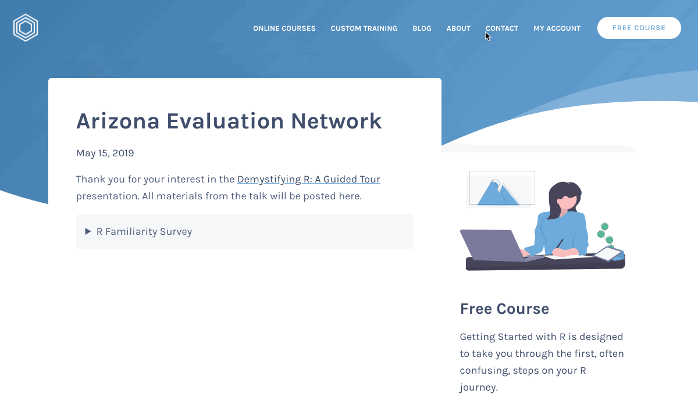
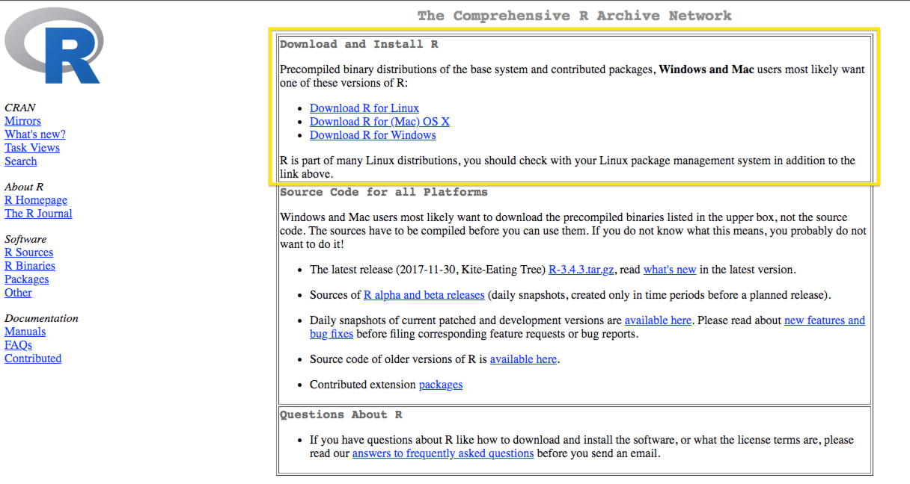
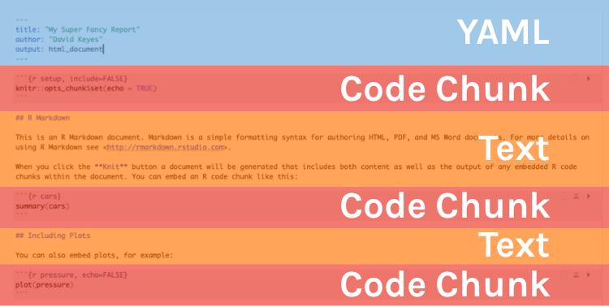

```{r setup, include=FALSE}
knitr::opts_chunk$set(eval = TRUE, 
                      echo = TRUE,
                      warning = FALSE,
                      message = FALSE,
                      rows.print = 5)

library(tidyverse)
library(here)


```

layout: true
  
<div class="dk-footer">
<span>
<a href="https://rfortherestofus.com/" target="_blank">R for the Rest of Us
</a>
</span>
</div> 

---

# Before We Start

Please take the survey at https://rfortherestofus.com/presentation/azenet/



---


class: inverse, center, middle, dk-section-title 

# What is R?


---

## Download and Install R

The first thing you need to do is download the R software. Go to the [Comprehensive R Archive Network (aka “CRAN”) website](https://cran.cnr.berkeley.edu/) and download the software for your operating system (Windows, Mac, or Linux).




---

## RStudio

--

.center[


.small[Courtesy [Modern Dive](http://moderndive.com/2-getting-started.html#what-are-r-and-rstudio)]
]


---

## Download and Install RStudio

Download RStudio at the [RStudio website](https://www.rstudio.com/products/rstudio/download/#download). Ignore the various versions listed there. All you need is the latest version of RStudio Desktop.


---
class: inverse, center, middle, dk-section-title 

# Packages

---

## Packages


--

.center[


.small[Courtesy [Modern Dive](http://moderndive.com/2-getting-started.html#packages)]
]

---

# Why Use R?

--


---

class: inverse, center, middle, dk-section-title

# How R Works

---

class: inverse, center, middle, dk-section-title

## Data Analysis

---

### Import Data

```{r echo = FALSE}
nhanes <- read_csv(here("data", "nhanes.csv"))
```

```{r eval = FALSE}
nhanes <- read_csv("data/nhanes.csv")
```

--

```{r echo = FALSE}
nhanes
```


---

### Data Analysis

```{r eval = FALSE}
nhanes %>% 
  count(education)
```

--

```{r echo = FALSE}
nhanes %>% 
  count(education)
```

---

### Data Analysis

```{r}
physically_active_education <- nhanes %>% 
  group_by(education) %>% 
  summarize(days_active = mean(phys_active_days, na.rm = TRUE)) %>% 
  mutate(days_active = round(days_active, 1)) %>% 
  drop_na(education)
```

--

```{r echo = FALSE}
physically_active_education
```


---

class: inverse, center, middle, dk-section-title

## Data Visualization

---


class: center, middle


---

class: center, middle


---


class: center, middle


---

class: inverse, center, middle, dk-section-title

## Reproducibility

---

### RMarkdown

Go from data import to final report, all in one tool.

---


### RMarkdown

Every RMarkdown document has the following:

--

1. **YAML** (one per document)

--

2. **Text** (repeated as many times as necessary)

--

3. **Code chunks** (repeated as many times as necessary)


---

### RMarkdown Overview



---

# The Best Reason to Learn R


---

class: inverse, center, middle, dk-section-title 

# Questions?

Please put them in the chat. 


---

# Learn More

All materials are posted at https://rfortherestofus.com/presentation/azenet/

Please email me with any questions: [david@rfortherestofus.com](mailto:david@rfortherestofus.com) 

I have made a coupon code (AZENETMAY2019) that will give you $50 off the just released [Fundamentals of R course](https://rfortherestofus.com/courses/fundamentals/). It expires May 31, 2019.