```{r setup, include=FALSE}
knitr::opts_chunk$set(eval = TRUE, 
                      echo = TRUE,
                      warning = FALSE,
                      message = FALSE,
                      rows.print = 5)

library(tidyverse)
library(here)
library(skimr)
library(fontawesome)
library(kableExtra)
library(janitor)
```


# Before We Start

Please take the survey at https://rfortherestofus.com/survey/

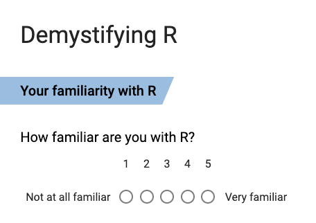


???

- https://forms.gle/1vzs2FaFjuBrv1Yy6
- All materials, including slides, are at that location
- Not going to actually show you how to use R (but I have a free course that does)


---

# Logistics

Video recording, slides, and report will be posted at https://rfortherestofus.com/demystifying/

--

If you have any questions, please put them in the chat (I'll stop if necessary)

--

There will also be time for Q&A at the end


---


class: inverse, center, middle 

# Who Are We?

???

- Not a hardcore quant: anthro PhD
- Starting using R when I was consulting so I could have a free option to replace Excel, SPSS, etc. Realized R was much more than that.
- Use R for descriptive stats, data visualization, creative reporting
- Realized the power of R and realized people are scared of it. Started RRU to offer training through online courses, training orgs, workshops, etc to help the rest of us learn R.

---

class: inverse, center, middle 

# What is R?

???

Was all command line before, but with RStudio, tidyverse, etc it's much easier to start now


---

### Download and Install R

The first thing you need to do is download the R software. Go to the [Comprehensive R Archive Network (aka “CRAN”) website](https://cran.cnr.berkeley.edu/) and download the software for your operating system (Windows, Mac, or Linux).


---

### R

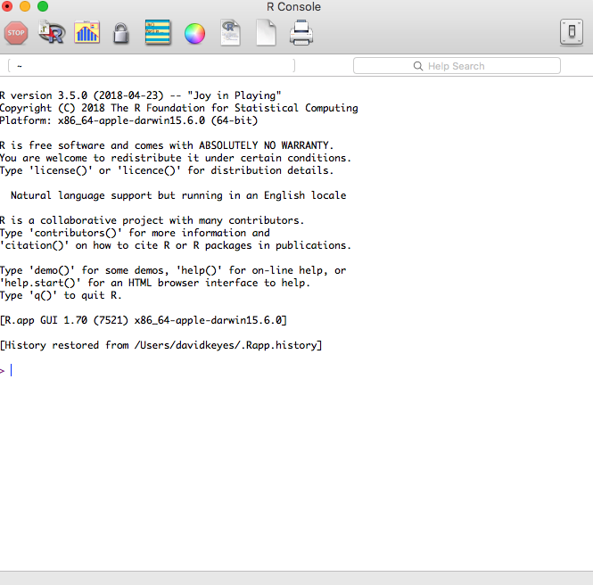

---

### RStudio

--

.center[
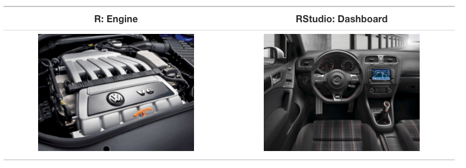

.small[Courtesy [Modern Dive](http://moderndive.com/2-getting-started.html#what-are-r-and-rstudio)]
]


---

### Download and Install RStudio

Download RStudio at the [RStudio website](https://www.rstudio.com/products/rstudio/download/). Ignore the various versions listed there. All you need is the latest version of RStudio Desktop.

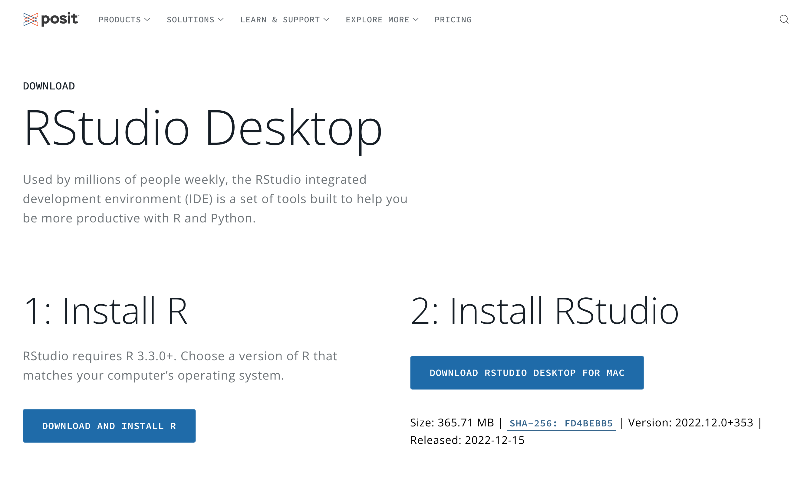

---

### RStudio

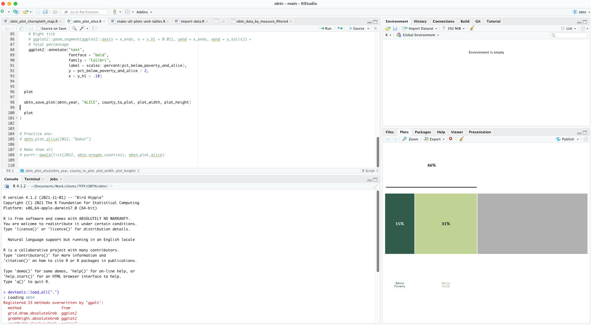


---
class: inverse, center, middle

# Packages

---

### Packages


--

.center[


.small[Courtesy [Modern Dive](http://moderndive.com/2-getting-started.html#packages)]
]

---

### Examples of Packages

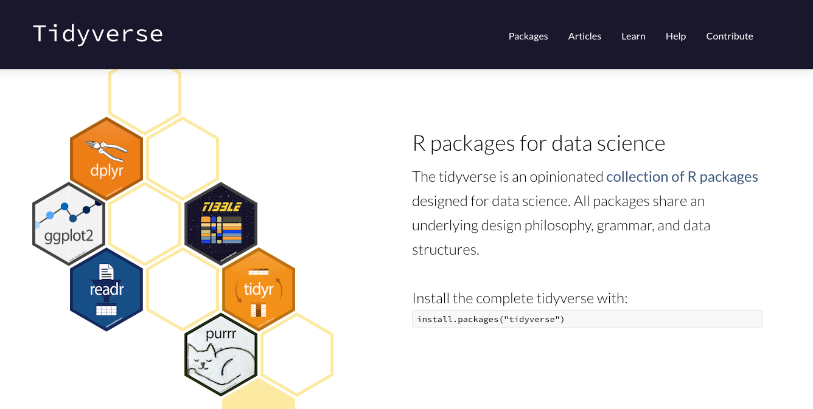

---

### Examples of Packages


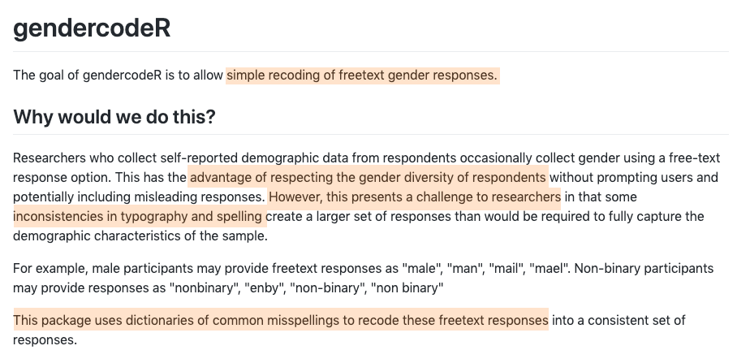

---

class: inverse, center, middle

# Why Use R?

???

- Many people are attracted to it because it's free
- It can do what you already do AND it can do more
- I'll provide three reasons to use R today


---

## Data Analysis in a Snap

```{r echo = FALSE}
nhanes <- read_csv(here::here("data", "nhanes.csv"))
```

```{r echo = FALSE}
nhanes %>% 
  head(10) %>% 
  select(gender, education, marital_status, height) %>% 
  rmarkdown::paged_table()
```

---

## Data Analysis in a Snap


```{r eval = FALSE}
nhanes %>% 
  group_by(gender) %>% 
  drop_na(height) %>% 
  summarize(mean_height = mean(height)) 
```

--

```{r echo = FALSE}
nhanes %>% 
  group_by(gender) %>% 
  drop_na(height) %>% 
  summarize(mean_height = mean(height)) 
```

---

class: inverse, center, middle

# High-Quality Data Visualization

???

Used by journalists from BBC, FT, etc


---


class: center, middle


---

class: center, middle

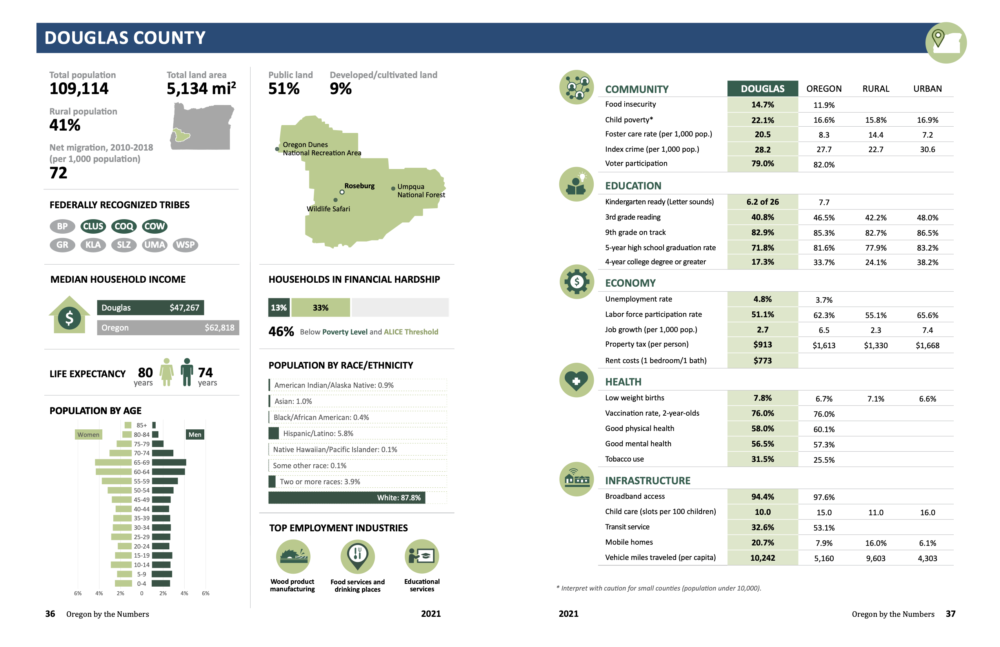

---


class: center, middle

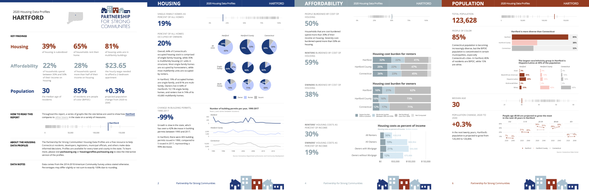
---

class: center, middle

[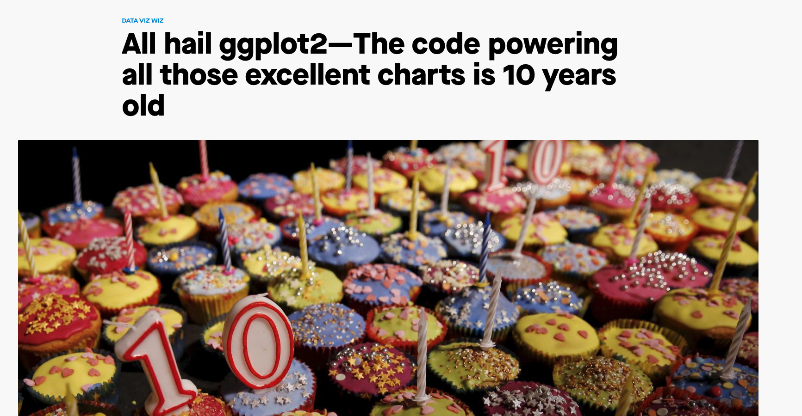](https://qz.com/1007328/all-hail-ggplot2-the-code-powering-all-those-excellent-charts-is-10-years-old/)

---

class: inverse, center, middle

# Unique Reporting Possibilities

---

class: center, middle

[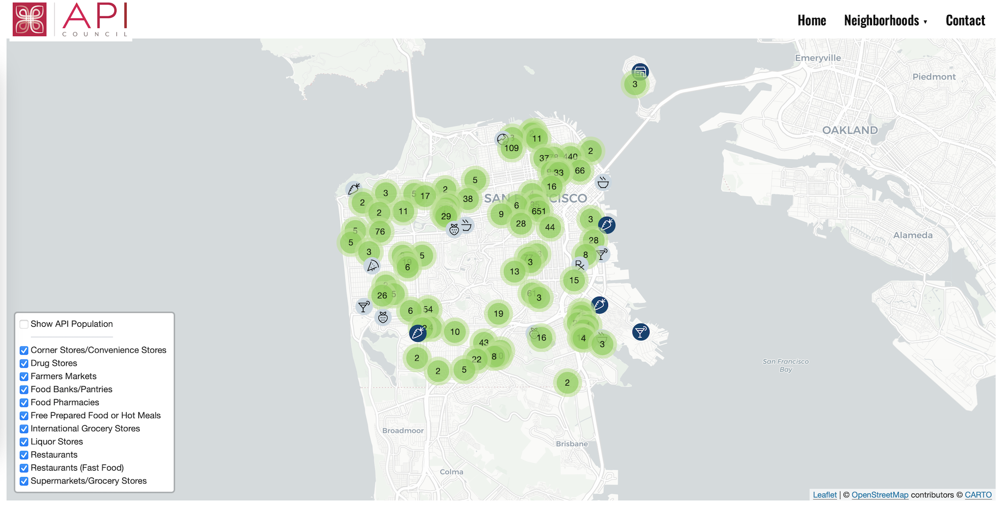](https://foodmap.apicouncil.org/)


---

class: inverse, center, middle

# R's Killer Feature: RMarkdown


---

class: center, middle

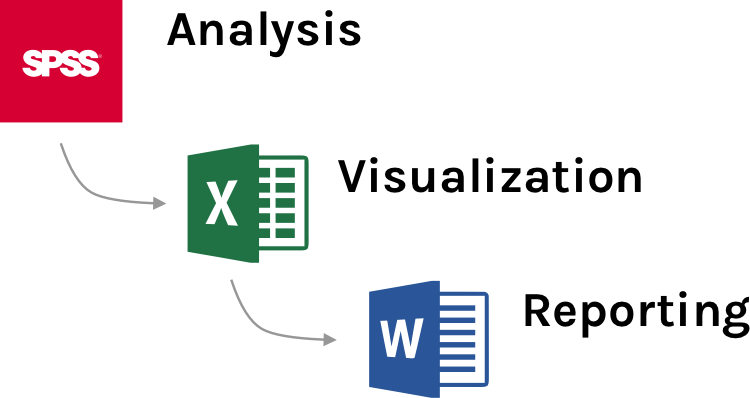

???

Problems: 
- What if data changes? 
- What if you need to produce reports for 10 sites?
- What if you need to redo report next year? 

---

### RMarkdown

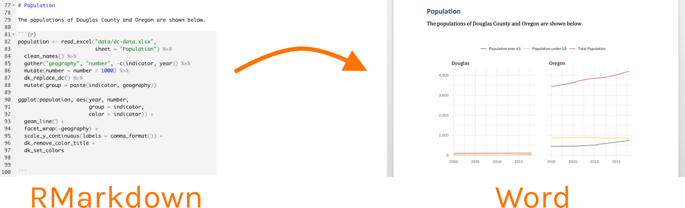

???

Combine text and code to produce reports


---

class: center, middle


> [A]ll the work is done up front and then for every session ... <b>I only need to spend 15 minutes generating the report and sending it to them</b>.

[Using R for Immediate Reporting in Evaluation by Dana Wanzer](https://danawanzer.com/using-r-for-immediate-reporting-in-evaluation/)

---


class: inverse, center, middle

# R Familiarity Survey

---

class: inverse, center, middle

# Parameterized Reporting


---

# The Best Reason to Learn R

--

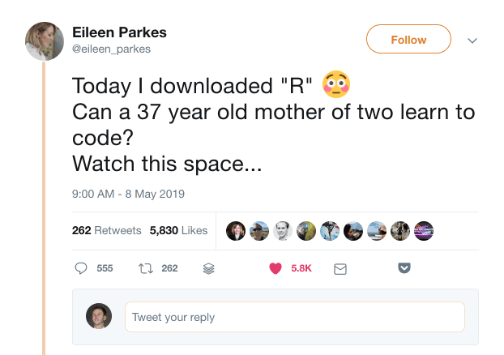


---

class: inverse, center, middle

# Questions?


---

class: inverse, center, middle

# Start Your R Journey

---

# Getting Started with R

[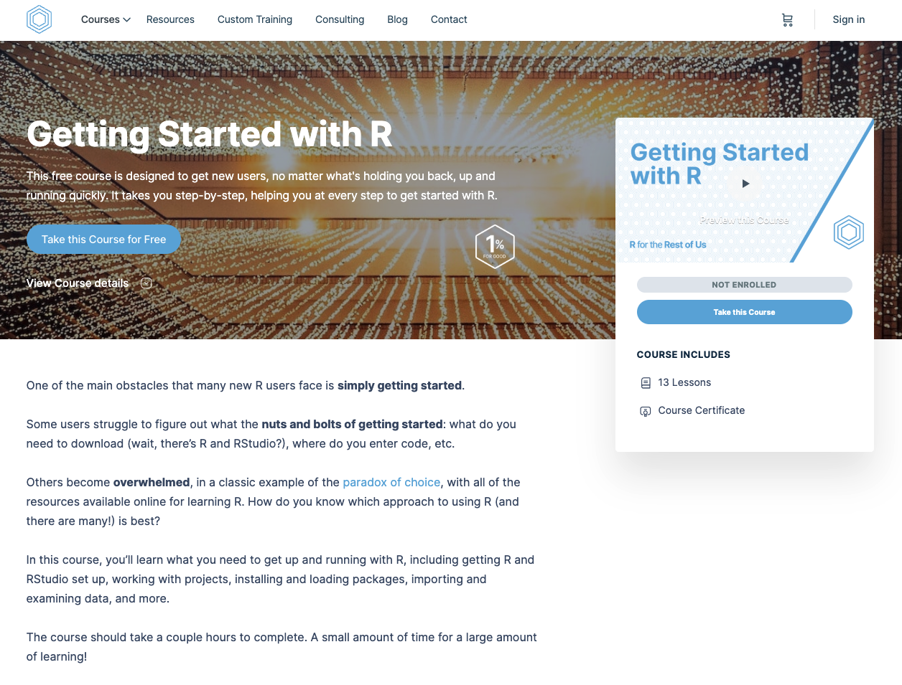](https://rfortherestofus.com/courses/getting-started/)

---


## R in 3 Months (rfor.us/3months)


---


class: middle

.pull-left[

]
.pull-right[
<br><br><br><br><br><br>
#### `r fa("envelope", fill = "#FF7400")`  [david@rfortherestofus.com](mailto:david@rfortherestofus.com) 

#### `r fa("twitter", fill = "#FF7400")`  [dgkeyes](twitter.com/dgkeyes)

#### `r fa("twitter", fill = "#FF7400")`  [rfortherest](twitter.com/rfortherest)
]