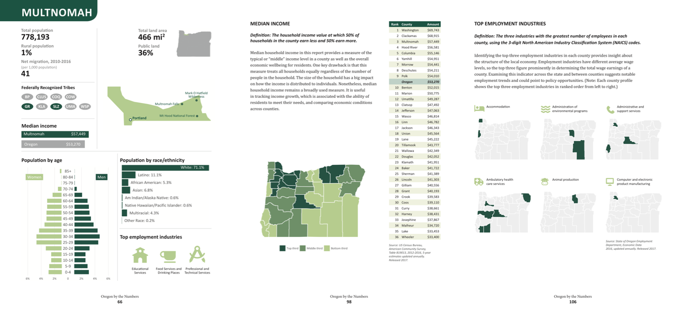
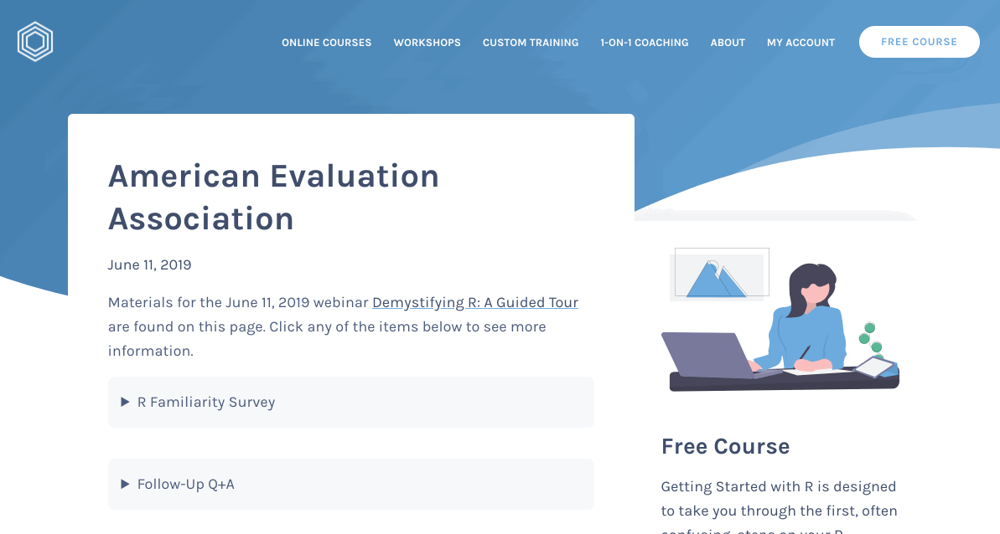

```{r setup, include=FALSE}
knitr::opts_chunk$set(eval = TRUE, 
                      echo = TRUE,
                      warning = FALSE,
                      message = FALSE,
                      rows.print = 5)

library(tidyverse)
library(here)
library(skimr)
library(fontawesome)


```

layout: true
  
<div class="dk-footer">
<span>
<a href="https://rfortherestofus.com/" target="_blank">R for the Rest of Us
</a>
</span>
</div> 

---

# Before We Start

Please take the survey at https://rfortherestofus.com/aea/


???

- All materials, including slides, are at that location
- Not going to actually show you how to use R (but I have a free course that does)


---


class: inverse, center, middle, dk-section-title 

# Who am I?

???

- Not a hardcore quant: anthro PhD
- Starting using R when I was consulting so I could have a free option to replace Excel, SPSS, etc. Realized R was much more than that.
- Use R for descriptive stats, data visualization, creative reporting
- Realized the power of R and realized people are scared of it. Started RRU to offer training through online courses, training orgs, workshops, etc to help the rest of us learn R.

---


class: inverse, center, middle, dk-section-title 

# What is R?

???

Was all command line before, but with RStudio, tidyverse, etc it's much easier to start now


---

## Download and Install R

The first thing you need to do is download the R software. Go to the [Comprehensive R Archive Network (aka “CRAN”) website](https://cran.cnr.berkeley.edu/) and download the software for your operating system (Windows, Mac, or Linux).


---

## RStudio

--

.center[


.small[Courtesy [Modern Dive](http://moderndive.com/2-getting-started.html#what-are-r-and-rstudio)]
]


---

## Download and Install RStudio

Download RStudio at the [RStudio website](https://www.rstudio.com/products/rstudio/download/). Ignore the various versions listed there. All you need is the latest version of RStudio Desktop.


---
class: inverse, center, middle, dk-section-title 

## Packages

---

### Packages


--

.center[


.small[Courtesy [Modern Dive](http://moderndive.com/2-getting-started.html#packages)]
]

---

### Examples of Packages


---

### Examples of Packages


---

class: inverse, center, middle, dk-section-title

# Why Use R?

???

- Many people are attracted to it because it's free
- It can do what you already do AND it can do more
- I'll provide three reasons to use R today


---

## Data Analysis in a Snap

```{r echo = FALSE}
nhanes <- read_csv(here::here("data", "nhanes.csv"))
```


```{r eval = FALSE}
nhanes %>% 
  skim(weight)
```

--

```{r echo = FALSE}
nhanes %>% 
  skim(weight)
```


---

class: inverse, center, middle, dk-section-title

## High-Quality Data Visualization

???

Used by journalists from BBC, FT, etc

---


class: center, middle


---

class: center, middle



---


class: center, middle


---

class: inverse, center, middle, dk-section-title

## Unique Reporting Possibilities

---

class: center, middle


---

class: inverse, center, middle, dk-section-title

## Use a Single Tool From Data Import to Final Report


---

class: center, middle


???

Problems: 
- What if data changes? 
- What if you need to produce reports for 10 sites?
- What if you need to redo report next year? 

---

### RMarkdown


???

Combine text and code to produce reports


---

### Give Immediate Feedback

--

<div class="dk-quote">
[A]ll the work is done up front and then for every session ... <b>I only need to spend 15 minutes generating the report and sending it to them</b>.
</div>

[Using R for Immediate Reporting in Evaluation by Dana Wanzer](https://danawanzer.com/using-r-for-immediate-reporting-in-evaluation/)

---


class: inverse, center, middle, dk-section-title

## R Familiarity Survey

---

## The Best Reason to Learn R

--


---

# Questions?



---

# Start Your R Journey

1. To join the Q+A and to get all materials from this webinar, please visit https://rfortherestofus.com/aea/

--

1. Visit https://rfortherestofus.com/workshops/ to vote for where I should take the R for the Rest of Us roadshow this fall.

--

1. I have created a coupon code (AEAJUNE2019) that will give you $50 off the just released [Fundamentals of R course](https://rfortherestofus.com/courses/fundamentals/). It expires June 30, 2019.

--

1. Please email me at any point with questions: [david@rfortherestofus.com](mailto:david@rfortherestofus.com) 